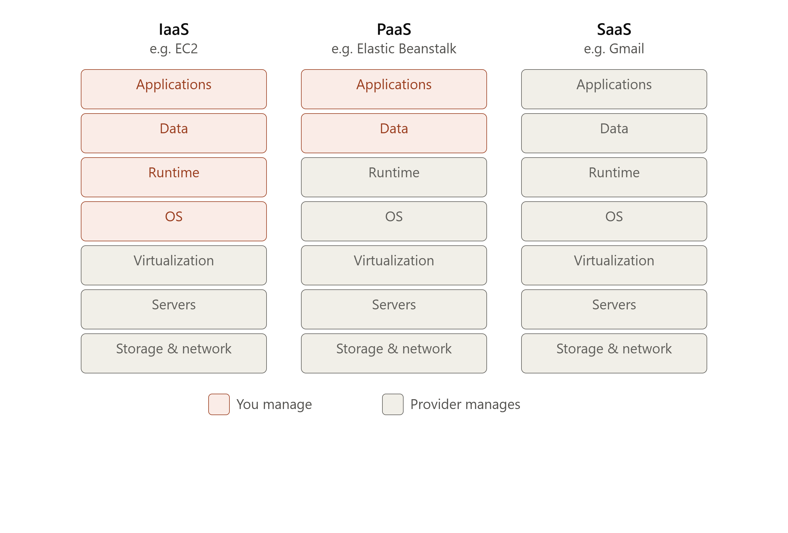

# AWS Solution Architect -SAA-C03
## 1. What is Cloud Computing, really?
Before "the cloud," if you wanted to run a website or app, you had to:
* Buy physical servers
* Set up a data center (or rent space in one)
* Install and maintain OS, networking, cooling, power backups
* Predict how much capacity you'd need (and often guess wrong)

**Cloud computing** is the delivery of computing resources — servers, storage, databases, networking, software — over the internet, on-demand, with pay-as-you-go pricing. 
Instead of owning the hardware, you rent it from a provider (AWS, Azure, Google Cloud) who owns and maintains massive data centers worldwide.  
Think of it like electricity. You don't build your own power plant to run a lightbulb — you plug into the grid and pay for what you use. Cloud computing does this for computing power.

## 2. Service Models — IaaS, PaaS, SaaS
This is one of the most important mental models for understanding AWS's product catalog.

1. **IaaS (Infrastructure as a Service)** — You get raw compute, storage, and networking. You manage the OS, runtime, and application. Maximum flexibility, maximum responsibility. AWS example: EC2.
2. **PaaS (Platform as a Service)** — The provider manages the OS and runtime; you just deploy your code. AWS example: Elastic Beanstalk, Lambda.
3. **SaaS (Software as a Service)** — Fully finished software you just use. No infrastructure thinking required. Example: Gmail, Slack, Dropbox.

## 3. Deployment Models

* **Public cloud** — Shared infrastructure owned by a third party (AWS, Azure, GCP), accessible to anyone over the internet. Cheapest, easiest to start with.
* **Private cloud** — Dedicated infrastructure for a single organization, either on-premises or hosted. Used when compliance/security demands full control.
* **Hybrid cloud** — A mix of private and public — e.g., sensitive data stays on-prem, everything else runs in AWS.
* **Multi-cloud** — Using more than one cloud provider (e.g., AWS + Azure) to avoid vendor lock-in or leverage specific strengths.

AWS is a public cloud provider — this is the model you'll be working in.

